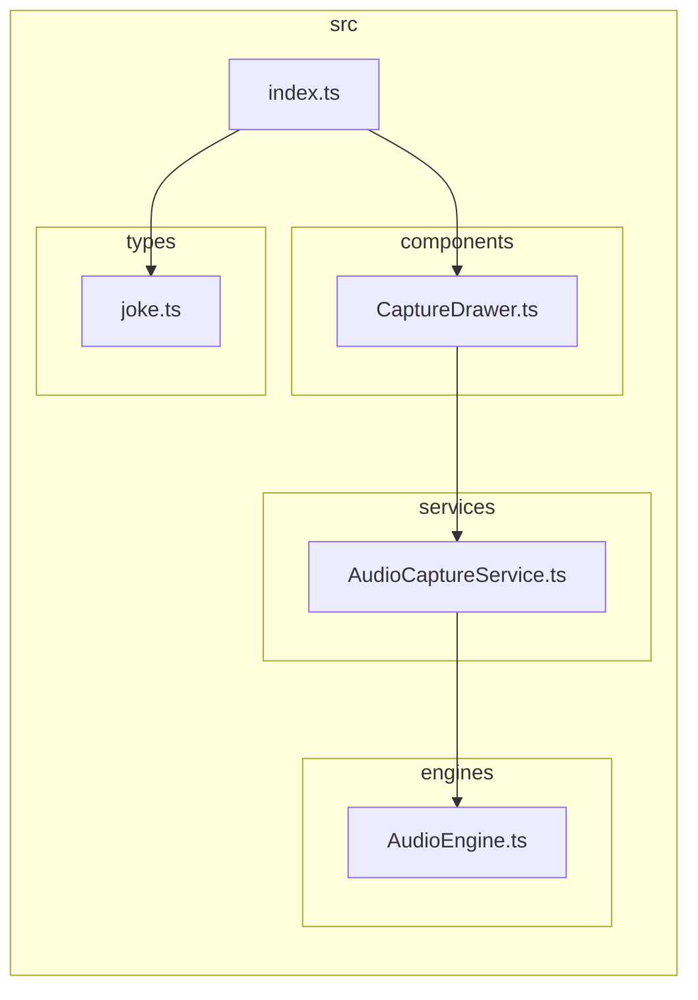

# 🕸️ Comedy OS — Live Codebase Dependency Map
*Auto-generated on 2026-10-26 via `npm run map`*

✅ **Status:** Zero boundary violations or circular dependencies detected.

## Module Import Graph

```mermaid
flowchart LR

subgraph src["src"]
  subgraph src_components["components"]
    src_components_CaptureDrawer_ts["CaptureDrawer.ts"]
  end
  subgraph src_services["services"]
    src_services_AudioCaptureService_ts["AudioCaptureService.ts"]
  end
  subgraph src_engines["engines"]
    src_engines_AudioEngine_ts["AudioEngine.ts"]
  end
  src_index_ts["index.ts"]
  subgraph src_types["types"]
    src_types_joke_ts["joke.ts"]
  end
end
src_components_CaptureDrawer_ts-->src_services_AudioCaptureService_ts
src_services_AudioCaptureService_ts-->src_engines_AudioEngine_ts
src_index_ts-->src_components_CaptureDrawer_ts
src_index_ts-->src_types_joke_ts
```
